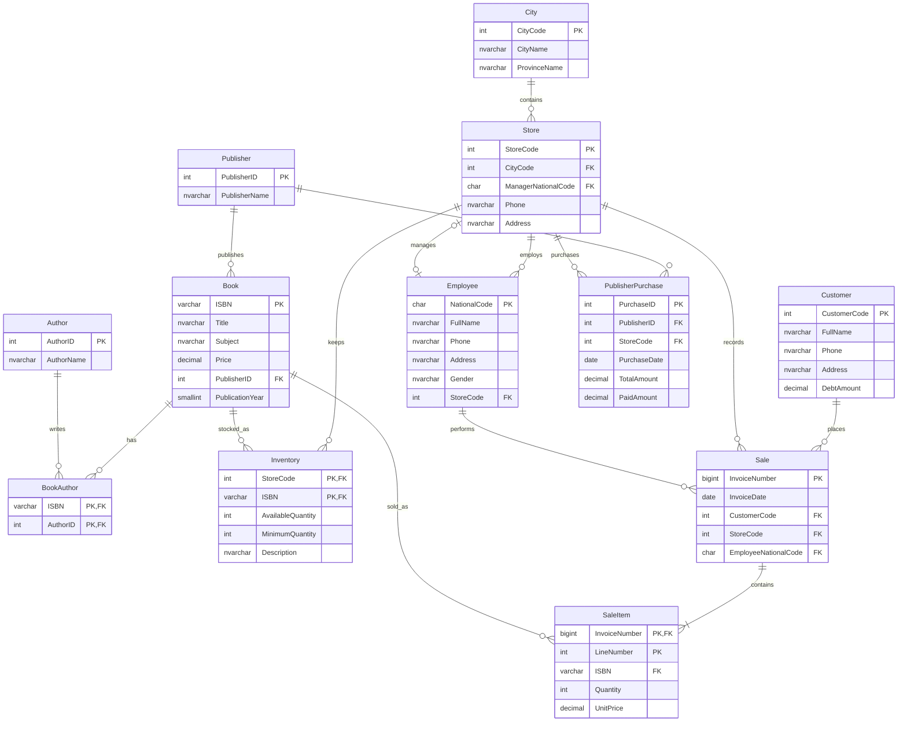

# نمودار ER پروژه شهر کتاب

```mermaid
erDiagram
    City ||--o{ Store : contains
    Store ||--o{ Employee : employs
    Employee o|--o| Store : manages
    Publisher ||--o{ Book : publishes
    Book ||--o{ BookAuthor : has
    Author ||--o{ BookAuthor : writes
    Store ||--o{ Inventory : keeps
    Book ||--o{ Inventory : stocked_as
    Customer ||--o{ Sale : places
    Store ||--o{ Sale : records
    Employee ||--o{ Sale : performs
    Sale ||--|{ SaleItem : contains
    Book ||--o{ SaleItem : sold_as
    Publisher ||--o{ PublisherPurchase : supplier
    Store ||--o{ PublisherPurchase : purchases

    City {
        int CityCode PK
        nvarchar CityName
        nvarchar ProvinceName
    }
    Store {
        int StoreCode PK
        int CityCode FK
        char ManagerNationalCode FK
        nvarchar Phone
        nvarchar Address
    }
    Employee {
        char NationalCode PK
        nvarchar FullName
        nvarchar Phone
        nvarchar Address
        nvarchar Gender
        int StoreCode FK
    }
    Customer {
        int CustomerCode PK
        nvarchar FullName
        nvarchar Phone
        nvarchar Address
        decimal DebtAmount
    }
    Publisher {
        int PublisherID PK
        nvarchar PublisherName
    }
    Author {
        int AuthorID PK
        nvarchar AuthorName
    }
    Book {
        varchar ISBN PK
        nvarchar Title
        nvarchar Subject
        decimal Price
        int PublisherID FK
        smallint PublicationYear
    }
    BookAuthor {
        varchar ISBN PK,FK
        int AuthorID PK,FK
    }
    Inventory {
        int StoreCode PK,FK
        varchar ISBN PK,FK
        int AvailableQuantity
        int MinimumQuantity
        nvarchar Description
    }
    Sale {
        bigint InvoiceNumber PK
        date InvoiceDate
        int CustomerCode FK
        int StoreCode FK
        char EmployeeNationalCode FK
    }
    SaleItem {
        bigint InvoiceNumber PK,FK
        int LineNumber PK
        varchar ISBN FK
        int Quantity
        decimal UnitPrice
    }
    PublisherPurchase {
        int PurchaseID PK
        int PublisherID FK
        int StoreCode FK
        date PurchaseDate
        decimal TotalAmount
        decimal PaidAmount
    }
```
